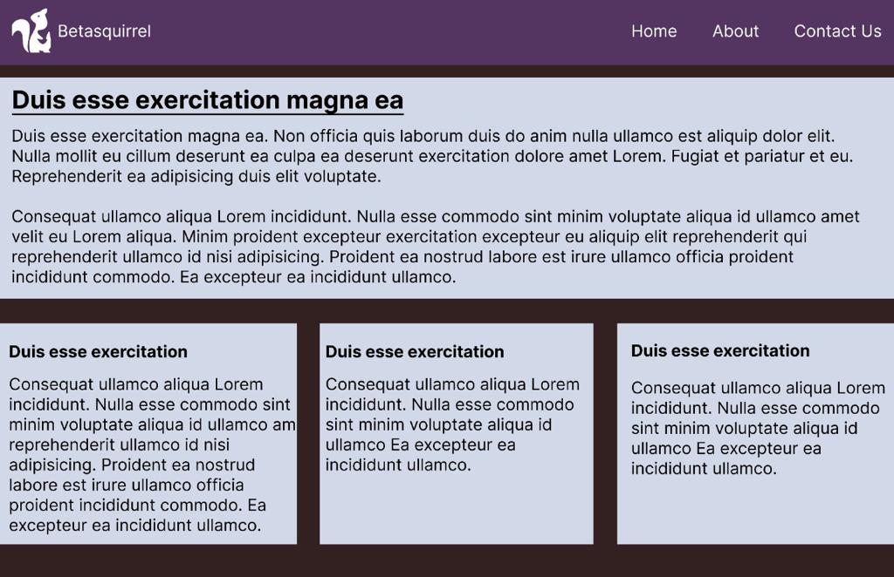
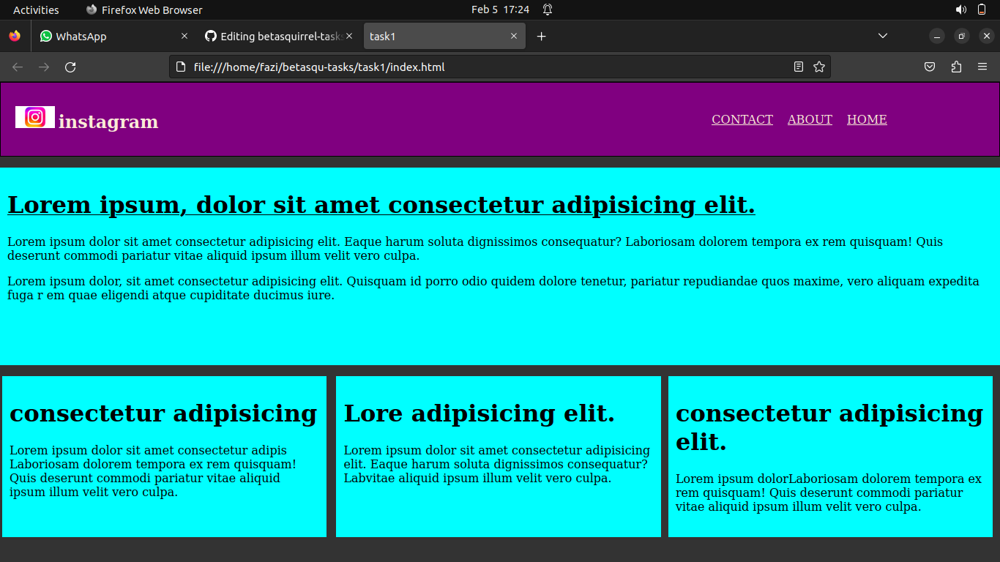
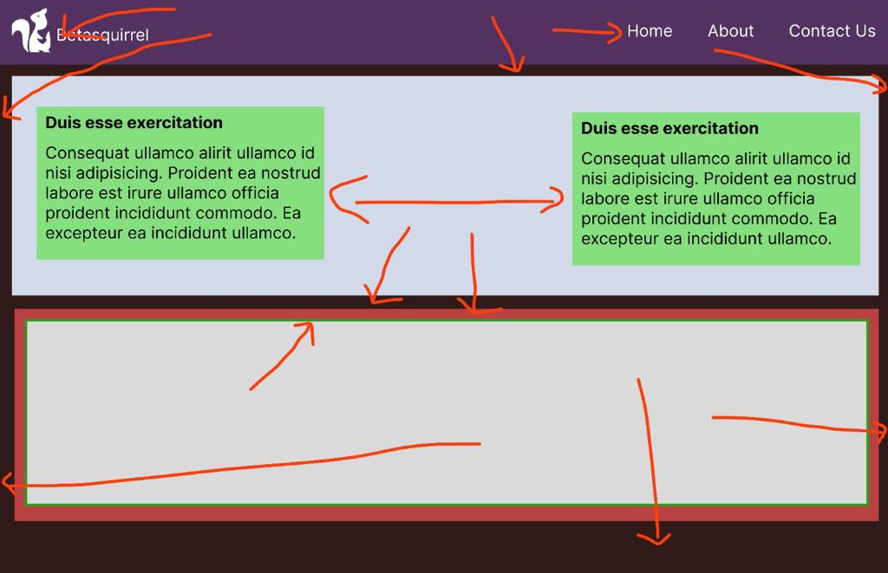
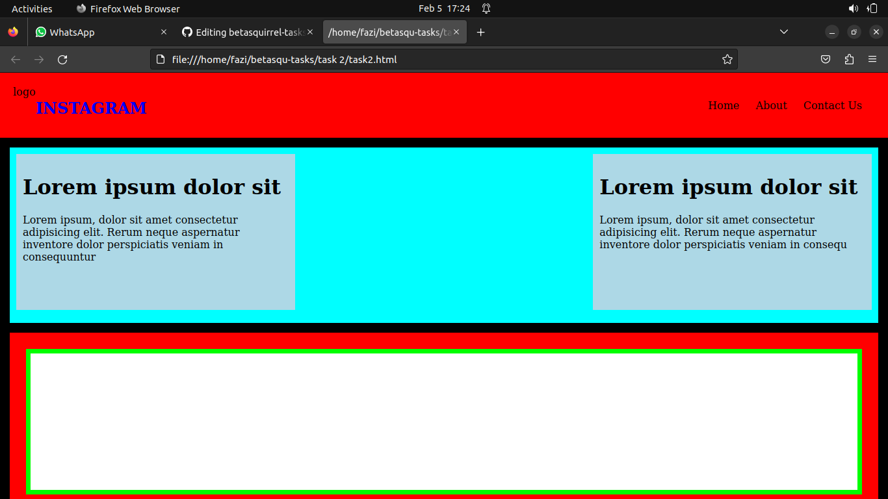
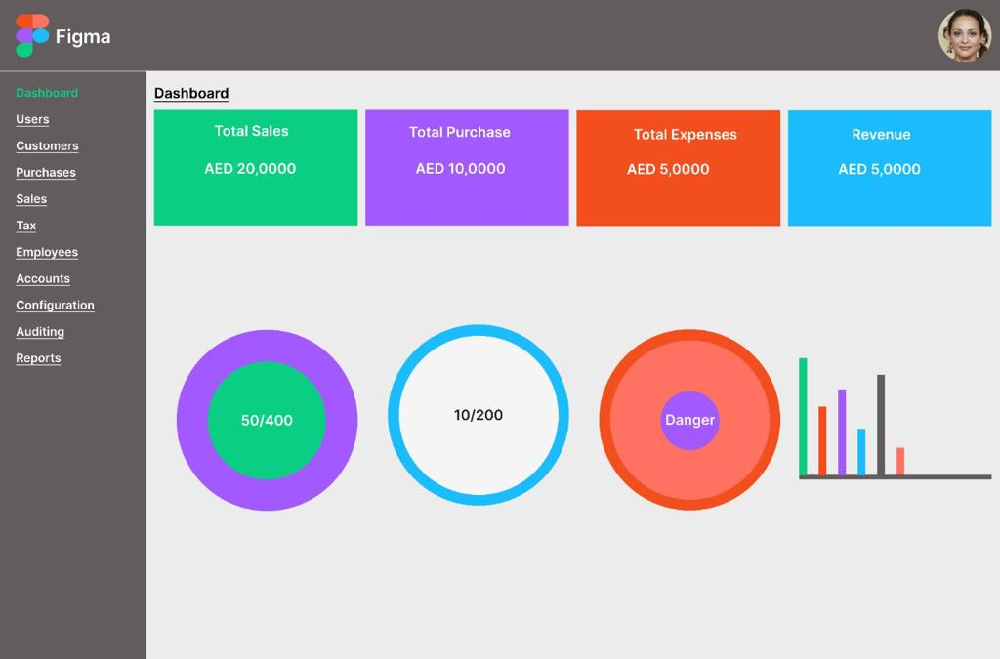
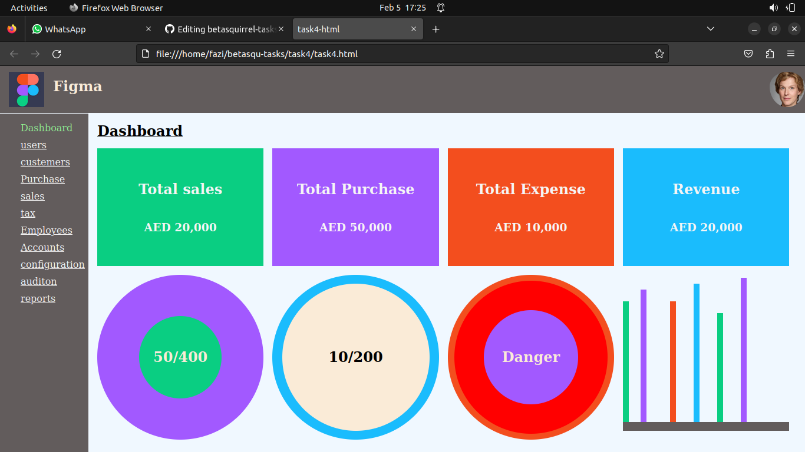

# betasqurirrel-tasks

### view of all tasks

 
## linux comment

- `cd` - enter to directory. Ex: `cd file name`
- `cd --` - back from floder to directory. Ex: `cd --file name`
- `ls` - show files in directory. 
- `ls -a` - show hidden files in directory.
- `pwd` - show  current working directory.
- `cat` - show contents in file. Ex: `cat filename`

## git comments

1. `git config` - Configure git user. Ex: `git config --global user.name "farhanareekode"`, `git config  --global user.email "farhanareekode@gmail.com"`
2. `git clone` - Clone a  git repositories to your local. Ex: `git clone git@github.com:farhanareekode/betasqu-tasks.git`, 
3. `git add` - Add your file changes to git. Ex: `git add file name.`, 
4. `git commit` - Commit changes to git. Ex: `git commit -m "Initial commit"
5. `git push` - Push your local commits to repositories. Ex: `git push origin main`
6. `git pull` - Pull updates your current local working branch. Ex: `git pull new-folder` 

## Task overview

| Requirements                 | Output                           |
| ---------------------------- | -------------------------------- |
|  |  |
|  |  |
|  |  |

 
 
## Task 3

Read and understand

- [HTML HOME](https://www.w3schools.com/html/default.asp)
- [HTML Introduction](https://www.w3schools.com/html/html_intro.asp)
- [HTML Editors](https://www.w3schools.com/html/html_editors.asp)
- [HTML Basic](https://www.w3schools.com/html/html_basic.asp)
- [HTML Elements](https://www.w3schools.com/html/html_elements.asp)
- [HTML Attributes](https://www.w3schools.com/html/html_attributes.asp)
- [HTML Headings](https://www.w3schools.com/html/html_headings.asp)
- [HTML Paragraphs](https://www.w3schools.com/html/html_paragraphs.asp)
- [HTML Styles](https://www.w3schools.com/html/html_styles.asp)
- [HTML Formatting](https://www.w3schools.com/html/html_formatting.asp)
- [HTML Quotations](https://www.w3schools.com/html/html_quotation_elements.asp)
- [HTML Comments](https://www.w3schools.com/html/html_comments.asp)
- [HTML Colors](https://www.w3schools.com/html/html_colors.asp)
- [HTML CSS](https://www.w3schools.com/html/html_css.asp)
- [HTML Links](https://www.w3schools.com/html/html_links.asp)
- [HTML Images](https://www.w3schools.com/html/html_images.asp)
- [HTML Id](https://www.w3schools.com/html/html_id.asp)
- [HTML Classes](https://www.w3schools.com/html/html_classes.asp)

## Task 5

Read and understand

- [HTML Favicon](https://www.w3schools.com/html/html_favicon.asp)
- [HTML Tables](https://www.w3schools.com/html/html_tables.asp)
- [HTML Table Borders](https://www.w3schools.com/html/html_table_borders.asp)
- [HTML Table Sizes](https://www.w3schools.com/html/html_table_sizes.asp)
- [HTML Table Headers](https://www.w3schools.com/html/html_table_headers.asp)
- [HTML Table Padding & Spacing](https://www.w3schools.com/html/html_table_padding_spacing.asp)
- [HTML Table Colspan & Rowspan](https://www.w3schools.com/html/html_table_colspan_rowspan.asp)
- [HTML Table Styling](https://www.w3schools.com/html/html_table_styling.asp)
- [HTML Table Colgroup](https://www.w3schools.com/html/html_table_colgroup.asp)
